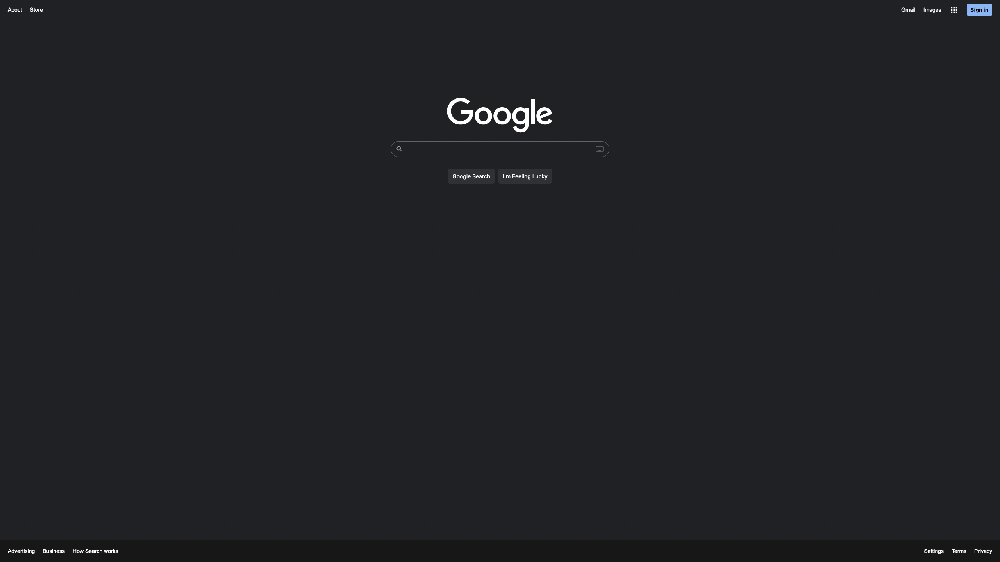

# Google Homepage Clone

## Made with HTML and CSS

In this project I tried to mimic Google's Homepage.
Through building the project I learned the basic stuff, like CSS positioning and lists, it might have taken me more than it should, but it was definetely worth it.

<a href="https://ionutianchis.github.io/google-homepage/">Live preview</a>

